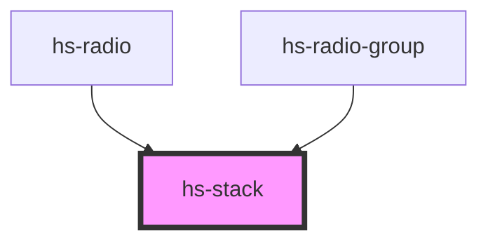

# hs-stack


<!-- Auto Generated Below -->


## Overview

The `<hs-stack>` component is a layout component providing horizontal and vertical
flow capabilities for all its children components and elements.

### Example
```html
<hs-stack orientation="vertical" gap="small">
 
 <button>Save</button>
</hs-stack>
```

## Properties

| Property      | Attribute     | Description                                                                                                    | Type                                                                       | Default      |
| ------------- | ------------- | -------------------------------------------------------------------------------------------------------------- | -------------------------------------------------------------------------- | ------------ |
| `gap`         | `gap`         | The `gap` property sets the spacing in between elements, and has no effect in the leading or trailing element. | `"large" \| "small"`                                                       | `'small'`    |
| `orientation` | `orientation` | The `orientation` property sets the direction for the flow, either vertical or horizontal.                     | `"horizontal" \| "horizontal-reverse" \| "vertical" \| "vertical-reverse"` | `'vertical'` |


## Dependencies

### Used by

 - [hs-radio](../hs-radio-group)
 - [hs-radio-group](../hs-radio-group)

### Graph


----------------------------------------------

*Built with [StencilJS](https://stenciljs.com/)*
